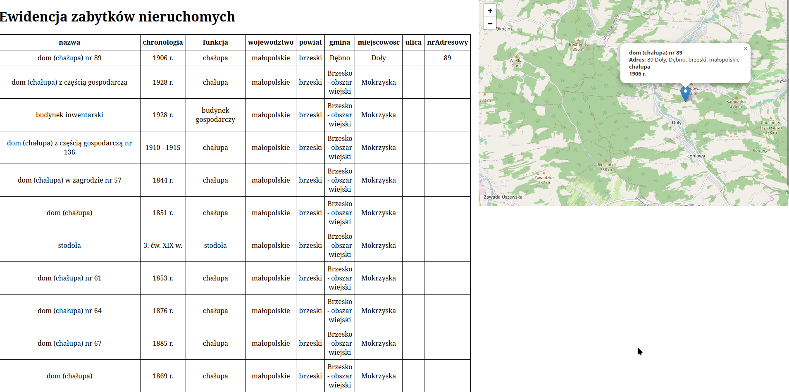

# Ewidencja zabytków

Serwis webowy realizujący funkcjonalności w oparciu o otwarte serwisy udostępniające REST API.
Użyte serwisy:
* https://dane.gov.pl/en/dataset/1130,rejestr-zabytkow-nieruchomych/resource/35929/table
* https://opencagedata.com/d.

Zadaniem serwisu jest pobranie zabytków z ewidencji dla danych parametrów zapytania, obróbka danych polegająca 
na dodaniu dodatkowych informacji takich jak geolokalizacja, którą następnie można zobaczyć po stronie klienta.



# Użycie

Przejdź do głównego folderu
```shell
cd rest-api-task
```

Utwórz środowisko pythona
```shell
python -m venv myenv
source myenv/bin/activate
```

Pobierz wymagane biblioteki
``` shell
pip install -r requirements.txt
```

# API klucze
Do poprawnego działania programu potrzeby nam będzie klucz 
do geolokalizacji. Projekt używa https://opencagedata.com/d.
Wystarczy podmienić klucz w pliku `.env`

```
Geocode-Api="YOUR KEY"
My-API=95a5843d98fdef6b1ea4e63b61b02b14
```

# Uruchomienie 
Aby uruchomić serwer wystarczy wykonać skrypt
```shell
./server.sh
```

Podobnie uruchamiamy klienta
```shell
./client.sh
```